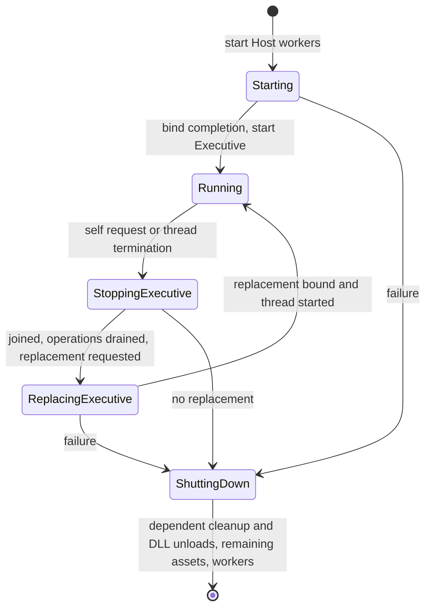

Copyright (c) 2026 Ritchie Brannan / Morphic Void Limited
License: MIT (see LICENSE file in repository root)

File:   asynchronous_module_lifecycle.md
Author: Ritchie Brannan
Drafting and editorial assistance: OpenAI Codex
Date:   21 Sep 2026

# Asynchronous module lifecycle

This reference describes the implemented Host DLL service, Executive startup
policy and passive rendering module. Completion history and validation evidence
are recorded in [completed milestones](../project/completed_milestones.md).

Module loading, binding, context installation, compatibility
checks and unloading now execute on the Host I/O worker. Both Host worker threads
use the same handlers, preserving the option to combine their work later.

## Startup and Executive transitions

The Host starts its two workers before requesting the Executive DLL. Its normal
message loop receives the binding completion and then creates the Executive
thread. Per-thread context installation still runs on the newly created thread,
because that operation installs thread-local state.

The default bootstrap path is `MorphicExecutive.dll`. The launcher accepts
`--executive=<DLL path>` to select another implementation advertising the Executive
identity and exporting the Executive thread function.

Rendering selection belongs to the Executive. The Host bootstraps only the
Executive; a selector implementation can run without a renderer or choose another
implementation later. The normal `MorphicExecutive.dll` first sends an owning
load request for `MorphicRendering.dll` and `render_vulkan_windows`. It validates
the correlated acknowledgement before accepting completion, then starts its
48 sequential and 32 concurrent asset acceptance operations only when rendering
is available.

After Executive replacement, `already_loaded` is accepted only for the requested
Vulkan identity with `available == true`; no extra thread, unload or replacement
is requested. Missing/unavailable services, failed completion and malformed
startup replies cause an Executive self-unload request. Initial request-submission
failure still marks Executive startup failed. The existing per-operation deadline
also covers the acknowledgement/completion phases and waiting for Host-requested
exit; there is no retry policy.

On receiving an Executive unload or replacement request, the Host immediately
sets that thread's exit-request state and wakes it. This happens before validation
or waiting for other work. The outgoing Executive receives neither acknowledgement
nor completion for that request. It must still return through its normal exit
path; the Host joins it before unloading the DLL. The Host also drains accepted
operations and disposes of the old thread package, including queued messages.

Self-unload without replacement requests full system shutdown. Self-replacement
keeps independent retained assets, cleans up assets dependent on the outgoing
Executive, unloads it, binds the replacement, and starts
its thread. Failure at any replacement stage produces an assertion-level log and
full orderly shutdown, without rollback, retries or an outgoing notification. The
diagnostic is logged without invoking a debugger breakpoint. Bootstrap failure
uses the same failure handling.

## Ordinary DLL operations

`ModuleRequest` owns its filename and carries an action (`load`, `unload`, or
`replace`), a registered module identity and an optional required function identity.
The mounting point encoded in the module identity selects the service being
changed. A replacement may select another registered implementation at that point.
Unload must identify the currently loaded implementation.

The Host sends two correlated `ModuleResult` notifications for requests concerning
other DLLs:

1. `acknowledged`: receipt for processing, before validation or worker execution.
2. `completed`: success or failure, with the available implementation and optional
   borrowed function pointer when applicable.

Acknowledgement does not establish readiness or permit renewed use. There is one
pending module operation at a time. A further ordinary request receives
acknowledgement followed by a `busy` completion. This is intentionally bounded;
there is no additional module-operation queue or automatic retry policy.

Successful completion means loading, binding, installation and any required
function lookup have all succeeded. At the rendering mount it also means the
Host has successfully started the rendering thread. The original binding ABI, version and
unsupported-function checks are retained. Failed installation is cleaned up by the
same worker. Replacement unloads the old implementation before loading the new
one. If the new load fails, the service remains unavailable. If unloading itself
is refused, the old binding remains present and the result reports that state.
A rendering binding whose thread was stopped is reported unavailable even if
unbinding fails; no automatic restart or rollback is attempted.

The requesting Executive must quiesce its use of the affected DLL until completion.
The default Executive response to a failed module operation is a self-unload
request, causing system shutdown. More selective recovery is left to future
Executive policy.

## Rendering DLL and thread

`MorphicRendering.vcxproj` is a separate solution project producing
`MorphicRendering.dll`. It uses the existing `render_vulkan_windows` module
identity at the `render` mount and the existing `rendering` thread identity.
Vulkan is the primary API planned for first implementation.
This stage contains no graphics API calls, graphics resources or actual rendering.

An ordinary owning `ModuleRequest` loads the DLL. The worker requires its
`rendering_thread_function` export regardless of whether the client requested
an additional function. The Host provisions a normal-priority `CThreadPackage`
using the bound module's advertised identity, stable memory context and
`CBoundModule::prepare_thread`. The entry point verifies the installed thread
context, publishes readiness, and parks on the existing wait predicate until
exit is requested. The normal Executive and applicable lifecycle fixtures request
rendering explicitly; renderer-free selector fixtures do not.

Rendering load/replacement keeps the module operation pending through thread
startup. A failed startup joins and destroys its package, then dispatches
unbind/unload back to the I/O worker before delivering the failure completion.
It reports `installation_failed` when that cleanup succeeds, or the cleanup
failure otherwise. Both acknowledgement and completion retain the original
client correlation.

Rendering unload/replacement requests exit and observes the terminal state
before draining the thread's final requests. The stopped package and its reply
transports remain alive until all accepted asset operations, including deferred
disposal replies, have completed. The Host then joins and destroys the package,
disposes remaining dependent assets, and dispatches unbinding. Full shutdown uses the
same path. Ordinary rendering transitions neither request Executive exit nor
suppress its replies. A loaded rendering thread survives Executive replacement
until a rendering request or full system shutdown stops it.

The real stub replaces the successful service fixture in lifecycle validation.
The test Executive, deliberate missing-export/failed-startup DLLs, and a rendering
fixture that posts disposals during exit remain fixtures; production rendering
contains no test switches.

## Ownership, dependencies and shutdown

The Host owns address-stable module records, their memory contexts and the owning
request envelope. `ModuleWorkRequest` borrows one stable job from the Host. Only the
worker mutates its binding objects until the completion is received. The job's
filename, registry, debug service and contexts outlive that borrow. Clients send
identities and owned filenames; they do not send borrowed binding objects into
the Host.

Worker jobs begin only after pending asset operations have drained. Asset transfers
preserve their explicit mounting-point dependency flags in the retained Host
carrier. Once a module's thread has exited and been joined, and asset operations
have drained, the Host expects no retained assets to depend on that module. If
any remain, it emits an assertion-level diagnostic and disposes of them before
dispatching unbind/unload to the I/O worker. This diagnostic does not trigger a
debugger breakpoint or cancel unloading. Independent assets remain retained.
The Executive and rendering DLL have Host-managed threads. Callers must still
quiesce their own use of affected DLL functions and borrowed views before
requesting unload or replacement.
Existing module memory-attribution checks also remain enforced. These checks complement the
Executive's quiescence convention; they do not track arbitrary cached function
pointers or introduce a general module reference-counting system.

Clients release individual retained assets with `AssetDisposeRequest`, a POD
containing only `CAssetId`. Its correlated `AssetDisposeResult` contains the ID and
success/failure status, with no borrowed views. The Host waits for already accepted
operations using the asset, rejects later saves using that ID, then destroys it.
An invalid, stale or already pending disposal ID receives `invalid_asset`.
Other borrowers must quiesce before requesting disposal; their views do not extend
lifetime. Requests can come from any connected thread package.

Full shutdown stops and joins the Executive, drains operations, performs the same
assertion and dependent-asset cleanup before each module unload, then releases
remaining independent assets while the I/O worker is still running. Only
after those completions does it stop the workers and debug service. If a terminal
worker/transport failure prevents safe unloading, cleanup retains native DLL
references until process exit instead of attempting DLL unloading on the Host
thread. The process exits unsuccessfully and logs the failure.

## Implementation map

- `core/system/transported_types.hpp`: requests, notices and worker exchange.
- `host/runtime/module_service.*`: admission, stable records, worker-job lifetime
  and completion routing, including thread-start completion.
- `host/runtime/host.cpp`: bootstrap, queue draining and thread/package lifetime.
- `host/runtime/host_worker_thread.cpp`: shared binding/unbinding handlers.
- `rendering/module/binding/*` and `rendering/runtime/*`: module binding and the
  passive wait-for-exit thread.
- `executive/runtime/executive_thread.cpp`: renderer selection and readiness gate.

## Validation

Run `tests/module_lifecycle/run_tests.ps1 -Configuration Debug -Platform x64`
from PowerShell. The script builds the solution and four roles of the standalone
`MorphicLifecycleFixture.vcxproj`, then launches isolated Host processes.
Use `Release` and/or `Win32` for other configurations; `-SkipBuild` requires all
matching solution and fixture binaries to have already been built.

The fixture project is maintained test infrastructure outside the solution.
It produces the Executive driver, missing-thread-export, failed-thread-start
and disposal-at-exit DLLs. Successful rendering service cases use the real stub.
The production renderer contains no test switches. Adding the fixture project
to the solution for IDE visibility is not required by the harness.

The 23 process cases cover:

- Correlated acknowledgement/completion, normal and duplicate loads, missing
  files/functions, replacement and unavailable service after failure.
- Executive bootstrap, self-shutdown without notifications, replacement and
  startup failures; selector Executives that never load rendering.
- Rendering load/unload/replacement, failed startup cleanup and Vulkan identity.
  A renderer survives Executive replacement and is reused without a second thread.
- Normal Executive startup and unavailable-renderer shutdown before asset work.
  Successful startup/replacement runs 48 sequential and 32 concurrent asset cases.
- Explicit disposal, invalid/stale IDs, saves admitted before disposal, dependent
  cleanup and preservation of unrelated retained assets.
- Disposal requests posted by rendering immediately before terminal publication:
  the final queue is drained and replies finish before package destruction.

Checks include process status, notification order, saved bytes, dependency
assertions, exit/join/unload ordering and I/O-worker attribution. In Debug the
exit-disposal regression must actually defer a reply for accepted saves, so it
cannot pass merely by missing the pending-operation condition. Missing/failing
normal-renderer tests use isolated binary copies under `build/`.

Core `MorphicTests -t1` covers dependency disposal and compact message compatibility.
Its real-Executive protocol tests exercise successful and already-loaded replies,
wrong identity/correlation, unavailable service, load failure, missing/duplicate
acknowledgement and initial submission failure. The test script and suites are
the executable coverage inventory; milestone counts describe dated runs.
