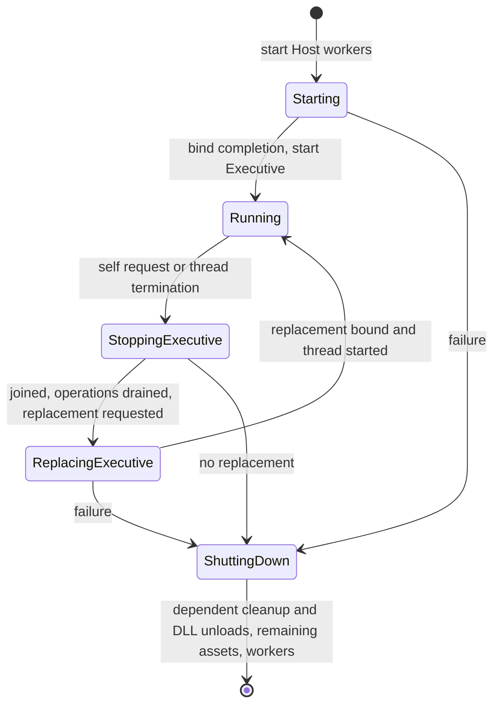

# Asynchronous module lifecycle

Updated 21 September 2026 for the rendering DLL stub. The preceding module and
asset-disposal stage is committed as `491ce78`. The rendering extension is
implemented with lifecycle and Vulkan identity coordinator reviews complete;
the user's style pass made no changes. The subsequent normal-Executive rendering
startup flow has passed coordinator review. The user accepted the work and
authorised its commit on 21 September.

Module loading, binding, context installation, compatibility
checks and unloading now execute on the Host I/O worker. Both Host worker threads
use the same handlers, preserving the option to combine their work later.

## Startup and Executive transitions

The Host starts its two workers before requesting the Executive DLL. Its normal
message loop receives the binding completion and then creates the Executive
thread. Per-thread context installation still runs on the newly created thread,
because that operation installs thread-local state.

The default bootstrap path is `MorphicExecutive.dll`. The launcher accepts
`--executive=<DLL path>` to select another implementation advertising the Executive
identity and exporting the Executive thread function.

Rendering selection belongs to the Executive. The Host bootstraps only the
Executive; a selector implementation can run without a renderer or choose another
implementation later. The normal `MorphicExecutive.dll` first sends an owning
load request for `MorphicRendering.dll` and `render_vulkan_windows`. It validates
the correlated acknowledgement before accepting completion, then starts its
48 sequential and 32 concurrent asset acceptance operations only when rendering
is available.

After Executive replacement, `already_loaded` is accepted only for the requested
Vulkan identity with `available == true`; no extra thread, unload or replacement
is requested. Missing/unavailable services, failed completion and malformed
startup replies cause an Executive self-unload request. Initial request-submission
failure still marks Executive startup failed. The existing per-operation deadline
also covers the acknowledgement/completion phases and waiting for Host-requested
exit; there is no retry policy.

On receiving an Executive unload or replacement request, the Host immediately
sets that thread's exit-request state and wakes it. This happens before validation
or waiting for other work. The outgoing Executive receives neither acknowledgement
nor completion for that request. It must still return through its normal exit
path; the Host joins it before unloading the DLL. The Host also drains accepted
operations and disposes of the old thread package, including queued messages.

Self-unload without replacement requests full system shutdown. Self-replacement
keeps independent retained assets, cleans up assets dependent on the outgoing
Executive, unloads it, binds the replacement, and starts
its thread. Failure at any replacement stage produces an assertion-level log and
full orderly shutdown, without rollback, retries or an outgoing notification. The
diagnostic is logged without invoking a debugger breakpoint. Bootstrap failure
uses the same failure handling.

## Ordinary DLL operations

`ModuleRequest` owns its filename and carries an action (`load`, `unload`, or
`replace`), a registered module identity and an optional required function identity.
The mounting point encoded in the module identity selects the service being
changed. A replacement may select another registered implementation at that point.
Unload must identify the currently loaded implementation.

The Host sends two correlated `ModuleResult` notifications for requests concerning
other DLLs:

1. `acknowledged`: receipt for processing, before validation or worker execution.
2. `completed`: success or failure, with the available implementation and optional
   borrowed function pointer when applicable.

Acknowledgement does not establish readiness or permit renewed use. There is one
pending module operation at a time. A further ordinary request receives
acknowledgement followed by a `busy` completion. This is intentionally bounded;
there is no additional module-operation queue or automatic retry policy.

Successful completion means loading, binding, installation and any required
function lookup have all succeeded. At the rendering mount it also means the
Host has successfully started the rendering thread. The original binding ABI, version and
unsupported-function checks are retained. Failed installation is cleaned up by the
same worker. Replacement unloads the old implementation before loading the new
one. If the new load fails, the service remains unavailable. If unloading itself
is refused, the old binding remains present and the result reports that state.
A rendering binding whose thread was stopped is reported unavailable even if
unbinding fails; no automatic restart or rollback is attempted.

The requesting Executive must quiesce its use of the affected DLL until completion.
The default Executive response to a failed module operation is a self-unload
request, causing system shutdown. More selective recovery is left to future
Executive policy.

## Rendering DLL and thread

`MorphicRendering.vcxproj` is a separate solution project producing
`MorphicRendering.dll`. It uses the existing `render_vulkan_windows` module
identity at the `render` mount and the existing `rendering` thread identity.
Vulkan is the primary API planned for first implementation.
This stage contains no graphics API calls, graphics resources or actual rendering.

An ordinary owning `ModuleRequest` loads the DLL. The worker requires its
`rendering_thread_function` export regardless of whether the client requested
an additional function. The Host provisions a normal-priority `CThreadPackage`
using the bound module's advertised identity, stable memory context and
`CBoundModule::prepare_thread`. The entry point verifies the installed thread
context, publishes readiness, and parks on the existing wait predicate until
exit is requested. The normal Executive and applicable lifecycle fixtures request
rendering explicitly; renderer-free selector fixtures do not.

Rendering load/replacement keeps the module operation pending through thread
startup. A failed startup joins and destroys its package, then dispatches
unbind/unload back to the I/O worker before delivering the failure completion.
It reports `installation_failed` when that cleanup succeeds, or the cleanup
failure otherwise. Both acknowledgement and completion retain the original
client correlation.

Rendering unload/replacement requests exit and observes the terminal state
before draining the thread's final requests. The stopped package and its reply
transports remain alive until all accepted asset operations, including deferred
disposal replies, have completed. The Host then joins and destroys the package,
disposes remaining dependent assets, and dispatches unbinding. Full shutdown uses the
same path. Ordinary rendering transitions neither request Executive exit nor
suppress its replies. A loaded rendering thread survives Executive replacement
until a rendering request or full system shutdown stops it.

The real stub replaces the successful service fixture in lifecycle validation.
The test Executive, deliberate missing-export/failed-startup DLLs, and a rendering
fixture that posts disposals during exit remain fixtures; production rendering
contains no test switches.

## Ownership, dependencies and shutdown

The Host owns address-stable module records, their memory contexts and the owning
request envelope. `ModuleWorkRequest` borrows one stable job from the Host. Only the
worker mutates its binding objects until the completion is received. The job's
filename, registry, debug service and contexts outlive that borrow. Clients send
identities and owned filenames; they do not send borrowed binding objects into
the Host.

Worker jobs begin only after pending asset operations have drained. Asset transfers
preserve their explicit mounting-point dependency flags in the retained Host
carrier. Once a module's thread has exited and been joined, and asset operations
have drained, the Host expects no retained assets to depend on that module. If
any remain, it emits an assertion-level diagnostic and disposes of them before
dispatching unbind/unload to the I/O worker. This diagnostic does not trigger a
debugger breakpoint or cancel unloading. Independent assets remain retained.
The Executive and rendering DLL have Host-managed threads. Callers must still
quiesce their own use of affected DLL functions and borrowed views before
requesting unload or replacement.
Existing module memory-attribution checks also remain enforced. These checks complement the
Executive's quiescence convention; they do not track arbitrary cached function
pointers or introduce a general module reference-counting system.

Clients release individual retained assets with `AssetDisposeRequest`, a POD
containing only `CAssetId`. Its correlated `AssetDisposeResult` contains the ID and
success/failure status, with no borrowed views. The Host waits for already accepted
operations using the asset, rejects later saves using that ID, then destroys it.
An invalid, stale or already pending disposal ID receives `invalid_asset`.
Other borrowers must quiesce before requesting disposal; their views do not extend
lifetime. Requests can come from any connected thread package.

Full shutdown stops and joins the Executive, drains operations, performs the same
assertion and dependent-asset cleanup before each module unload, then releases
remaining independent assets while the I/O worker is still running. Only
after those completions does it stop the workers and debug service. If a terminal
worker/transport failure prevents safe unloading, cleanup retains native DLL
references until process exit instead of attempting DLL unloading on the Host
thread. The process exits unsuccessfully and logs the failure.

## Review and validation

- `core/system/transported_types.hpp`: grouped messages, notifications and their
  consolidated type registrations.
- `host/runtime/module_service.*`: the exclusively borrowed worker job, admission,
  stable records and completion routing.
- `host/runtime/host.cpp`: bootstrap, Executive transitions and shutdown ordering.
- `host/runtime/host_worker_thread.cpp`: shared binding/unbinding handlers.
- `rendering/module/binding/*` and `rendering/runtime/*`: standard module binding
  and the minimal wait-for-exit thread.
- `tests/module_lifecycle/fixture.cpp`: Executive driver and deliberate rendering
  missing-export/startup-failure and disposal-at-exit DLL fixtures.
- `tests/module_lifecycle/run_tests.ps1`: maintained integration harness, rather
  than a one-off editing script. It builds the four fixture roles of the standalone
  `MorphicLifecycleFixture.vcxproj` and runs the Host in separate processes.

The harness checks acknowledgement/completion ordering; load, replacement and
unload success; duplicate and missing modules; missing required functions;
unavailable service after failed replacement; explicit asset disposal, invalid
and stale identities, disposal after queued saves, independent asset preservation,
and assertion-based dependency cleanup before ordinary unload, Executive
replacement and shutdown;
Executive exit requests without notifications; successful Executive replacement;
failed replacement, failed bootstrap and Executive thread startup failures before
and after replacement. It checks exit codes, assertion counts
and that module execution is reported by the I/O worker. Successful replacement
runs the normal Executive's 48 sequential and 32 concurrent asset operations while
an asset retained from the outgoing Executive remains owned by the Host.

Example: `tests/module_lifecycle/run_tests.ps1 -Configuration Debug -Platform x64`.
Use `Win32` for x86 and `-SkipBuild` when the matching solution and fixture DLLs
have already been built. The ordinary Core suites also cover dependency lookup,
selective dependency disposal and compact module/disposal-message compatibility.

All twelve lifecycle scenarios and the Core suites passed in Debug/Release on
x64/Win32, with solution and fixture builds, policy validation, diff whitespace
and repository line-ending checks passing. Validation evidence for
the disposal revision is recorded in `build/module-disposal-*-lifecycle.log`
and `build/module-disposal-*-tests.log`; each lifecycle log names its exact
process event logs.

The 21 September review pass consolidates the module headers, groups transported
types and registrations, adds the missing worker request diagnostics and tidies
spacing, comments and enum initialisers. That stage was accepted and committed
before the rendering extension described above.

After that tidy-up, the Core suites and all twelve lifecycle scenarios passed
again in Debug/Release x64/Win32. Evidence is in
`build/module-review-{dbg64,rel64,dbg32,rel32}-{lifecycle,tests}.log`.
The Debug replacement log also confirms the added module and document request
diagnostics on the I/O and conditioning workers respectively.

The user's manual style pass and coordinator check are complete. A fresh Debug
x64 build, all twelve lifecycle scenarios and the Core suites passed afterwards:
`build/module-manual-style-dbg64-lifecycle.log` and
`build/module-manual-style-dbg64-tests.log`. Whitespace and line-ending checks
also passed. These final checks do not claim a fresh four-configuration run
after formatting-only edits; the preceding matrix remains recorded above.

### Rendering extension validation

The rendering stage passed solution and three-role fixture builds, all 18
lifecycle scenarios, and the Core `-t1` suites in Debug/Release x64/Win32.
The six added cases cover failed rendering startup on load and replacement,
the mandatory missing thread export, shutdown with a live rendering thread,
dependent cleanup on rendering shutdown/replacement, rendering survival across
Executive replacement, and unloading after 32 accepted saves. Existing ordinary
operations and disposal cases now run against the real threaded rendering DLL.

The harness checks thread exit before join, join before rendering unload or
dependency disposal, matching start/join counts, worker-only DLL operations,
reply ordering, expected assertion counts and process exit status. It also
checks that rendering stays active throughout the replacement Executive's
48 sequential and 32 concurrent asset operations.

Evidence from 21 September:

- `build/rendering-lifecycle-debug-x64-final.log`: 18 cases, process tag
  `lifecycle-ceebcec7` (build evidence in `build/rendering-build-debug-x64.log`
  and `build/rendering-lifecycle-debug-x64.log`).
- `build/rendering-lifecycle-release-x64.log`: 18 cases, `lifecycle-66ed0ba2`.
- `build/rendering-lifecycle-debug-win32.log`: 18 cases, `lifecycle-8d3b9e95`.
- `build/rendering-lifecycle-release-win32.log`: 18 cases, `lifecycle-7d3147ed`.
- `build/rendering-core-{debug-x64,release-x64,debug-win32,release-win32}.log`:
  all Core suites passed with exit code zero.

The final explicit rendering-survival assertion was also checked against all
four recorded process logs. Policy builds reported no errors or warnings;
whitespace and tracked-file line-ending checks passed, and the new files were
checked separately for LF source/project text and CRLF filter metadata. An
initial sandboxed Core attempt encountered DebugService log/service failures;
the unrestricted rerun passed. Validation covers Windows Debug/Release, not the
Development configuration or other operating systems.

### Coordinator review: rendering package lifetime

Review identified that a rendering-originated disposal could retain a reply
pointer to its package after the initial teardown destroyed it. Sampling terminal
state after the queue drain could also lose a final request. The correction now
samples rendering state before queue draining and retains the stopped package
and transports until accepted asset operations are idle. Only then does the Host
join/destroy the package and proceed to dependency cleanup and unbinding.

The `RenderingDisposal` fixture posts two valid asset disposals during exit. The
first waits for accepted saves; the second is the final request before terminal
publication. The Executive confirms both identities are stale after unload, the
saved 1 MiB contents are intact, and no dependency-cleanup assertion was needed.
Debug diagnostics additionally require an actually deferred first disposal and
both completions before package teardown, so a run that misses the pending-save
condition cannot silently pass. The production rendering stub remains passive.

After this correction, solution/four-role fixture builds and all 19 lifecycle
cases passed in Debug/Release x64/Win32. Evidence is in
`build/rendering-review-lifecycle-{debug-x64,release-x64,debug-win32,release-win32}.log`,
with process tags `16f1a0db`, `02f00f95`, `c6d722cd` and `201611b9` respectively.
Whitespace and tracked-file line-ending checks passed again. Core sources and
tests were unchanged by this correction; their passing matrix above was not
repeated. Final coordinator review verified the correction and recorded log
ordering with no outstanding findings. The user subsequently accepted the work
and authorised its commit on 21 September.

### Vulkan identity selection

The subsequent user-directed identity change selects the existing
`render_vulkan_windows` identity for the stub and its lifecycle fixtures.
Project/DLL names, mounting point, thread identity and lifecycle behavior are
unchanged. Tests now also check reply identities and Vulkan thread attribution.
Solution/four-role fixture builds and all 19 lifecycle cases passed in
Debug/Release x64/Win32; evidence is in
`build/rendering-vulkan-lifecycle-{debug-x64,release-x64,debug-win32,release-win32}.log`
with tags `d4c92891`, `d500ff75`, `02b9f4b3` and `72efd068` respectively.
Whitespace and line-ending checks passed. Unchanged Core suites were not repeated.
Coordinator review verified the identity changes and validation evidence with no
outstanding findings. This follow-up is included in the accepted rendering stage.

### Normal Executive rendering startup

The later startup-policy follow-up moves the rendering choice into the normal
Executive's first owning request, followed by correlated acknowledgement and
completion phases. The 48 sequential/32 concurrent asset acceptance flow begins
only after a successful, available matching renderer result, including the
explicit `already_loaded` case after Executive replacement.

All 23 lifecycle cases and Core `-t1` suites passed in Debug/Release x64/Win32.
The four new process cases cover normal startup and orderly Executive self-unload
for a missing rendering DLL, failed rendering thread startup and missing thread
export. Failure cases use isolated binary copies under `build/`, leaving the
normal binaries intact. Existing selector cases require zero rendering starts;
the survival case requires the replacement Executive to reuse its one renderer.

The real-Executive tests in `ErasedOwner_test_suite.cpp` additionally cover
successful/new and already-loaded readiness, unavailable or wrong-implementation
results, load failure, completion before acknowledgement, wrong correlation and
duplicate acknowledgement. The existing initial submission-failure regression
now checks the rendering request diagnostic. The suite passed 631 checks in each
configuration, with no residual Executive memory attribution.

Evidence is in
`build/executive-rendering-lifecycle-{debug-x64,release-x64,debug-win32,release-win32}.log`
(tags `0d3b933a`, `87ef5f2e`, `91404227`, `68912f1c`) and
`build/executive-rendering-core-{debug-x64,release-x64,debug-win32,release-win32}.log`.
The Debug Core rebuild is recorded separately in
`build/executive-rendering-core-build-debug-x64.log`. Build policy, whitespace and
line-ending checks passed. Coordinator review verified the startup flow, protocol
tests and recorded lifecycle evidence with no outstanding findings. This follow-up
is accepted for commit; fixture project solution membership is unchanged.
