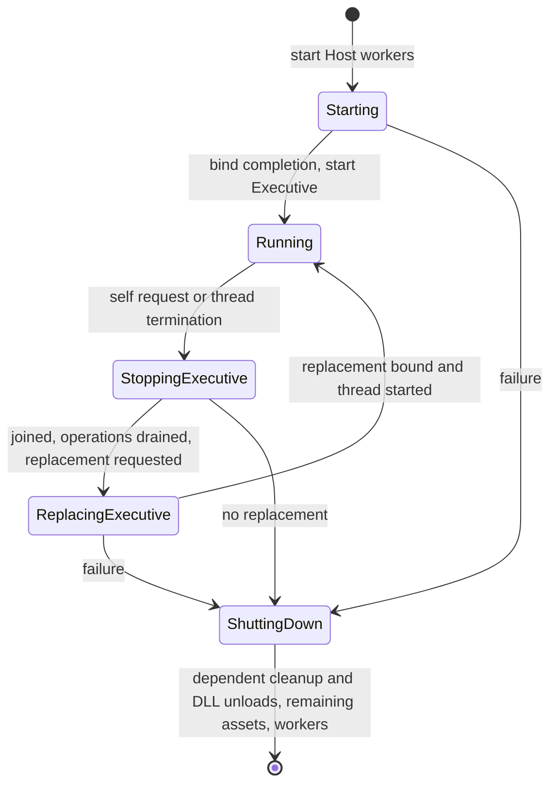

# Asynchronous module lifecycle

Updated 21 September 2026 after user review and the manual style pass.
Implementation and coordinator verification are complete; the user authorised
the commit on 21 September.

Module loading, binding, context installation, compatibility
checks and unloading now execute on the Host I/O worker. Both Host worker threads
use the same handlers, preserving the option to combine their work later.

## Startup and Executive transitions

The Host starts its two workers before requesting the Executive DLL. Its normal
message loop receives the binding completion and then creates the Executive
thread. Per-thread context installation still runs on the newly created thread,
because that operation installs thread-local state.

The default bootstrap path is `MorphicExecutive.dll`. The launcher accepts
`--executive=<DLL path>` to select another implementation advertising the Executive
identity and exporting the Executive thread function.

On receiving an Executive unload or replacement request, the Host immediately
sets that thread's exit-request state and wakes it. This happens before validation
or waiting for other work. The outgoing Executive receives neither acknowledgement
nor completion for that request. It must still return through its normal exit
path; the Host joins it before unloading the DLL. The Host also drains accepted
operations and disposes of the old thread package, including queued messages.

Self-unload without replacement requests full system shutdown. Self-replacement
keeps independent retained assets, cleans up assets dependent on the outgoing
Executive, unloads it, binds the replacement, and starts
its thread. Failure at any replacement stage produces an assertion-level log and
full orderly shutdown, without rollback, retries or an outgoing notification. The
diagnostic is logged without invoking a debugger breakpoint. Bootstrap failure
uses the same failure handling.

## Ordinary DLL operations

`ModuleRequest` owns its filename and carries an action (`load`, `unload`, or
`replace`), a registered module identity and an optional required function identity.
The mounting point encoded in the module identity selects the service being
changed. A replacement may select another registered implementation at that point.
Unload must identify the currently loaded implementation.

The Host sends two correlated `ModuleResult` notifications for requests concerning
other DLLs:

1. `acknowledged`: receipt for processing, before validation or worker execution.
2. `completed`: success or failure, with the available implementation and optional
   borrowed function pointer when applicable.

Acknowledgement does not establish readiness or permit renewed use. There is one
pending module operation at a time. A further ordinary request receives
acknowledgement followed by a `busy` completion. This is intentionally bounded;
there is no additional module-operation queue or automatic retry policy.

Successful completion means loading, binding, installation and any required
function lookup have all succeeded. The original binding ABI, version and
unsupported-function checks are retained. Failed installation is cleaned up by the
same worker. Replacement unloads the old implementation before loading the new
one. If the new load fails, the service remains unavailable. If unloading itself
is refused, the old binding remains present and the result reports that state.

The requesting Executive must quiesce its use of the affected DLL until completion.
The default Executive response to a failed module operation is a self-unload
request, causing system shutdown. More selective recovery is left to future
Executive policy.

## Ownership, dependencies and shutdown

The Host owns address-stable module records, their memory contexts and the owning
request envelope. `ModuleWorkRequest` borrows one stable job from the Host. Only the
worker mutates its binding objects until the completion is received. The job's
filename, registry, debug service and contexts outlive that borrow. Clients send
identities and owned filenames; they do not send borrowed binding objects into
the Host.

Worker jobs begin only after pending asset operations have drained. Asset transfers
preserve their explicit mounting-point dependency flags in the retained Host
carrier. Once a module's thread has exited and been joined, and asset operations
have drained, the Host expects no retained assets to depend on that module. If
any remain, it emits an assertion-level diagnostic and disposes of them before
dispatching unbind/unload to the I/O worker. This diagnostic does not trigger a
debugger breakpoint or cancel unloading. Independent assets remain retained.
The Executive is currently the only DLL with a Host-managed thread; callers must
quiesce other DLL activity before requesting unload or replacement.
Existing module memory-attribution checks also remain enforced. These checks complement the
Executive's quiescence convention; they do not track arbitrary cached function
pointers or introduce a general module reference-counting system.

Clients release individual retained assets with `AssetDisposeRequest`, a POD
containing only `CAssetId`. Its correlated `AssetDisposeResult` contains the ID and
success/failure status, with no borrowed views. The Host waits for already accepted
operations using the asset, rejects later saves using that ID, then destroys it.
An invalid, stale or already pending disposal ID receives `invalid_asset`.
Other borrowers must quiesce before requesting disposal; their views do not extend
lifetime. Requests can come from any connected thread package.

Full shutdown stops and joins the Executive, drains operations, performs the same
assertion and dependent-asset cleanup before each module unload, then releases
remaining independent assets while the I/O worker is still running. Only
after those completions does it stop the workers and debug service. If a terminal
worker/transport failure prevents safe unloading, cleanup retains native DLL
references until process exit instead of attempting DLL unloading on the Host
thread. The process exits unsuccessfully and logs the failure.

## Review and validation

- `core/system/transported_types.hpp`: grouped messages, notifications and their
  consolidated type registrations.
- `host/runtime/module_service.*`: the exclusively borrowed worker job, admission,
  stable records and completion routing.
- `host/runtime/host.cpp`: bootstrap, Executive transitions and shutdown ordering.
- `host/runtime/host_worker_thread.cpp`: shared binding/unbinding handlers.
- `tests/module_lifecycle/fixture.cpp`: real service and Executive DLL fixtures.
- `tests/module_lifecycle/run_tests.ps1`: maintained integration harness, rather
  than a one-off editing script. It builds both roles of the standalone
  `MorphicLifecycleFixture.vcxproj` and runs the Host in separate processes.

The harness checks acknowledgement/completion ordering; load, replacement and
unload success; duplicate and missing modules; missing required functions;
unavailable service after failed replacement; explicit asset disposal, invalid
and stale identities, disposal after queued saves, independent asset preservation,
and assertion-based dependency cleanup before ordinary unload, Executive
replacement and shutdown;
Executive exit requests without notifications; successful Executive replacement;
failed replacement, failed bootstrap and Executive thread startup failures before
and after replacement. It checks exit codes, assertion counts
and that module execution is reported by the I/O worker. Successful replacement
runs the normal Executive's 48 sequential and 32 concurrent asset operations while
an asset retained from the outgoing Executive remains owned by the Host.

Example: `tests/module_lifecycle/run_tests.ps1 -Configuration Debug -Platform x64`.
Use `Win32` for x86 and `-SkipBuild` when the matching solution and fixture DLLs
have already been built. The ordinary Core suites also cover dependency lookup,
selective dependency disposal and compact module/disposal-message compatibility.

All twelve lifecycle scenarios and the Core suites passed in Debug/Release on
x64/Win32, with solution and fixture builds, policy validation, diff whitespace
and repository line-ending checks passing. Validation evidence for
the disposal revision is recorded in `build/module-disposal-*-lifecycle.log`
and `build/module-disposal-*-tests.log`; each lifecycle log names its exact
process event logs.

The 21 September review pass consolidates the module headers, groups transported
types and registrations, adds the missing worker request diagnostics and tidies
spacing, comments and enum initialisers. The rendering DLL stub is deferred to a
separate stage after acceptance and commit of this work.

After that tidy-up, the Core suites and all twelve lifecycle scenarios passed
again in Debug/Release x64/Win32. Evidence is in
`build/module-review-{dbg64,rel64,dbg32,rel32}-{lifecycle,tests}.log`.
The Debug replacement log also confirms the added module and document request
diagnostics on the I/O and conditioning workers respectively.

The user's manual style pass and coordinator check are complete. A fresh Debug
x64 build, all twelve lifecycle scenarios and the Core suites passed afterwards:
`build/module-manual-style-dbg64-lifecycle.log` and
`build/module-manual-style-dbg64-tests.log`. Whitespace and line-ending checks
also passed. These final checks do not claim a fresh four-configuration run
after formatting-only edits; the preceding matrix remains recorded above.
